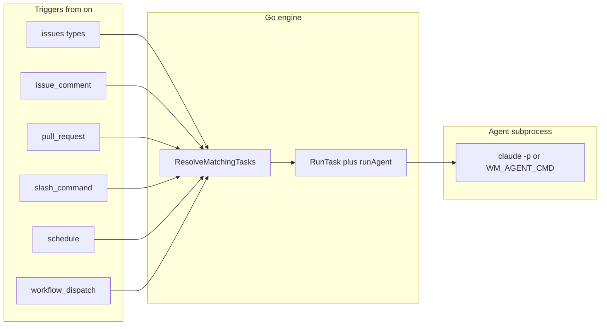
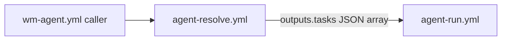

# Architecture

## Goals (design intent)

- **gh-aw format compatibility**: Task files use Markdown + YAML frontmatter like [Agentic Workflows (gh-aw)](https://github.github.io/gh-aw/); you can drop community workflows into `.wm/tasks/`.
- **No compile step**: No `.lock.yml`, no `gh aw compile`.
- **Go + `go-gh`**: GitHub auth follows `gh auth login` (see [`internal/ghclient`](../internal/ghclient/) for API usage from commands like `assign`).
- **Thin coordination on GitHub**: Issues, labels, Actions, PRs—no extra control plane.

## High-level pipeline

Each task conceptually follows **trigger → resolve → run agent**. The current codebase implements **event matching** and **agent execution**; structured “output handlers” (auto-open PR, post comment) as separate Go modules are part of the long-term design but **not** wired in `engine` yet—the agent is expected to use Git/`gh` itself.

## Code map

| Concern | Location | Role |
|---------|----------|------|
| CLI entry | [`cmd/`](../cmd/) | Cobra commands: `init`, `upgrade`, `assign`, `resolve`, `run`, `status`, `logs`. |
| Config + tasks | [`internal/config/`](../internal/config/) | Load `.wm/config.yml`, parse `.wm/tasks/*.md` frontmatter ([`frontmatter.go`](../internal/config/frontmatter.go)). |
| Event → task names | [`internal/trigger/match.go`](../internal/trigger/match.go) | `MatchOnOR`: implements `on:` OR-semantics against [`types.GitHubEvent`](../internal/types/types.go). |
| Orchestration | [`internal/engine/`](../internal/engine/) | `ResolveMatchingTasks` ([`resolver.go`](../internal/engine/resolver.go)), `RunTask` + `runAgent` ([`runner.go`](../internal/engine/runner.go), [`agent.go`](../internal/engine/agent.go)). |
| `wm-agent.yml` generation | [`internal/gen/wmagent.go`](../internal/gen/wmagent.go), [`schedules.go`](../internal/gen/schedules.go) | Union of `on.schedule` strings; writes caller workflow. |
| Embedded templates | [`internal/templates/`](../internal/templates/) | Starters for init (`config.yml`, tasks, `CLAUDE.md`). |
| Optional checkpoint format | [`internal/checkpoint/`](../internal/checkpoint/checkpoint.go) | Encode/decode `<!-- wm-checkpoint: … -->` comments (library present; not yet integrated into `RunTask`). |

## GitHub Actions: two reusable workflows

Business repos use an **auto-generated** `wm-agent.yml` (from `gh wm init` / `gh wm upgrade`) that calls into **this** repository’s reusable workflows.

1. **`agent-resolve.yml`** ([`.github/workflows/agent-resolve.yml`](../.github/workflows/agent-resolve.yml))  
   - Checks out the repo, installs `gh-wm` (`go install`), writes `event.json`, runs:
   - `gh-wm resolve --repo-root . --event-name "$EVENT_NAME" --payload event.json --json`  
   - Exposes the printed JSON array as job output `tasks`.

2. **`agent-run.yml`** ([`.github/workflows/agent-run.yml`](../.github/workflows/agent-run.yml))  
   - Matrix over `fromJSON(needs.resolve.outputs.tasks)` with `fail-fast: false`.  
   - Runs `gh-wm run --repo-root . --task "$TASK_NAME" --event-name "$EVENT_NAME" --payload event.json` with `ANTHROPIC_API_KEY` for the agent.

**Note:** In CI, the installed binary name is `gh-wm`. When installed as a `gh` extension, the same commands are available as `gh wm …`.

## Resolve behavior details

- [`engine.ResolveMatchingTasks`](../internal/engine/resolver.go) loads all tasks and keeps those where `trigger.MatchOnOR(event, task.OnMap())` is true.
- **Schedule events**: For `event_name == schedule`, every task that includes `on.schedule` matches at resolve time. Optional filter: if `WM_SCHEDULE_CRON` is set (e.g. to the workflow’s cron string), tasks are further filtered with `trigger.ScheduleCronMatches` so only the intended task runs for that cron.
- **Payload**: Event JSON is read from `--payload` or `GITHUB_EVENT_PATH`; name from `--event-name` or `GITHUB_EVENT_NAME`.

## Run behavior details

- [`engine.RunTask`](../internal/engine/runner.go) loads config + tasks, finds the task by filename stem, builds [`TaskContext`](../internal/types/types.go) (repo path, `GITHUB_REPOSITORY`, issue/PR numbers from payload), then calls `runAgent`.
- [`runAgent`](../internal/engine/agent.go) builds the prompt from the task body + optional context files from `context.files` in `.wm/config.yml`, then runs `WM_AGENT_CMD` if set, else `claude -p <prompt>`.
- **Timeout**: The `run` command uses a **45-minute** context timeout ([`cmd/run.go`](../cmd/run.go)); `timeout-minutes` in frontmatter is not yet applied as a hard deadline in code.

## Security posture (minimal)

- No sandbox or `safe-outputs` enforcement in-process; workflow permissions and branch protection apply.
- Draft PR defaults live in config for **future** automation; agent behavior depends on the invoked CLI.
