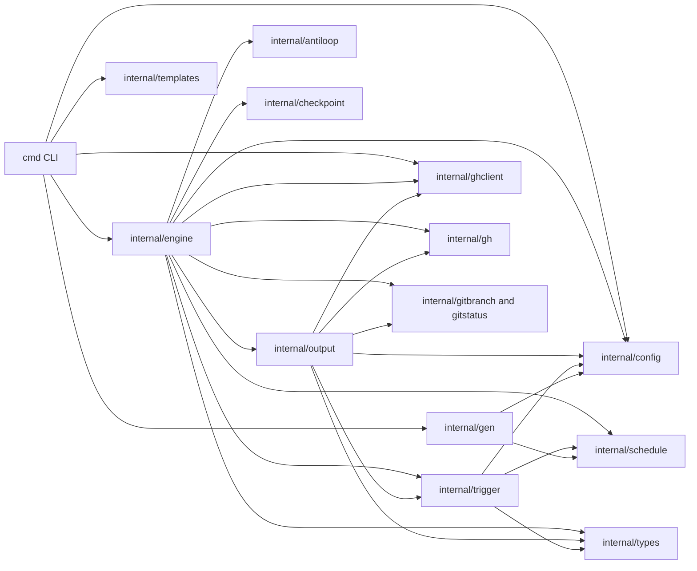
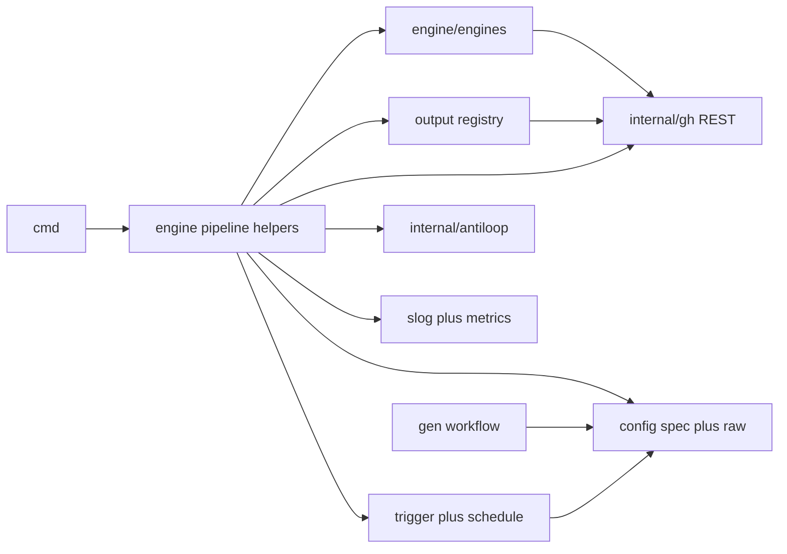

# Architecture review and roadmap

This document complements [architecture.md](architecture.md) with a **design review** of gh-wm, a **target module layout** for extensibility, and a **phased refactor roadmap** (v2). It is the canonical place for “why we’re changing structure” decisions.

## Goals (recap)

- **gh-aw compatibility** for task Markdown + YAML frontmatter.
- **No compile step** for workflows.
- **Thin GitHub coordination** (issues, labels, Actions, PRs).
- **Safe outputs** as a policy boundary between agent intent and GitHub writes.

## Strengths

- Clear **five-phase pipeline** (`activation → agent → validation → safe-outputs → conclusion-defer`) with deferred cleanup that survives early failures.
- **CLI / engine / infra split**: `cmd/` stays thin; `internal/engine/` orchestrates; GitHub I/O is isolated behind helpers.
- **Per-run artifacts** (`prompt.md`, `output.jsonl`, agent transcript, `meta.json`, `result.json`, optional `run.json`) support debugging and CI introspection.
- **Loop prevention** is layered: workflow (`concurrency`, `if:` on actor), resolver (bot sender), and content (`<!-- wm-agent:` marker on wm-authored comments).
- **Declarative tasks** keep community workflows portable.

## Weaknesses (prioritized)

1. **Engine selection** was historically a single switch in `runAgent`; extending backends required touching multiple files. **Mitigation:** `internal/engine/engines` package with a small `Engine` interface.
2. **Safe outputs** were a large `switch`; new kinds touched parse, policy, prompt, and execution. **Mitigation:** `output.Handler` registry (one file per kind).
3. **Frontmatter** used `map[string]any` with ad-hoc accessors; invalid shapes surfaced late. **Mitigation:** `internal/config/spec` typed views + validation at load time.
4. **GitHub I/O** mixed `gh api` helpers and direct `exec.Command("gh", …)` calls. **Mitigation:** `internal/gh` REST client (via `github.com/cli/go-gh/v2/pkg/api`) with typed errors.
5. **Global config cache** (`sync.Map` in `config.Load`) is convenient for CLI but hurts long-lived processes/tests. **Mitigation:** documented; optional future `Loader` type.
6. **Phase bookkeeping** in `RunTask` was manual (easy to miss `UpdateMeta`). **Mitigation:** `engine/pipeline` helpers.
7. **Workflow generator** duplicated two large YAML templates. **Mitigation:** single template with an `Inline` flag.
8. **Observability** mixed `log.Printf` and stderr banners. **Mitigation:** `log/slog` with run-id attributes where wired.
9. **`timeout-minutes`** lived in `cmd/run` only; library callers of `RunTask` did not get the same timeout. **Mitigation (v2):** timeout applied inside `RunTask` / CLI delegates.

## Current module graph

## Target architecture

**Boundaries:**

- **`engines.Engine`**: argv, stdin, artifact basename, stream formatting hooks.
- **`output.Handler`**: parse → policy → execute; prompt fragments composed from registered kinds.
- **`gh.API`**: REST operations with `errors.Is` for not found / rate limit when available.
- **`antiloop`**: marker strings, comment decoration, resolver skip helpers.

## Phased roadmap

### Phase 0 — Quick wins

- Fix `concludeArgs.glob` so GITHUB_STEP_SUMMARY can read model from config.
- Extract **`internal/antiloop`** (marker prefix/footer; resolver skip helpers).
- Move **`FuzzyNormalizeSchedule`** to **`internal/schedule`** (break `trigger → gen` import).
- Consolidate YAML/JSON scalar coercion in **`internal/config/scalar`**.

### Phase 1 — Typed config

- **`internal/config/spec`**: typed `TaskSpec` / `GlobalSpec` views, validation, JSON schema artifact (`docs/content/task-schema.json`).

### Phase 2 — Engine interface

- **`internal/engine/engines`**: `claude`, `codex`, `custom` (`WM_AGENT_CMD`); **`copilot`** placeholder removed.

### Phase 3 — Safe-output registry

- **`output.Register`**: one handler per kind; `RunSuccessOutputs` dispatches by kind.

### Phase 4 — `internal/gh`

- REST client via **`github.com/cli/go-gh/v2/pkg/api`**; replace ad-hoc `exec gh` in output paths where practical. High-level flows (`gh pr create`, `gh issue create`) may still shell out when no stable REST helper is inlined.

### Phase 5 — Pipeline + observability

- Phase helpers + structured logging hooks.
- **`run.json`**: merged run snapshot (also keeps `meta.json` / `result.json` for compatibility).

### Phase 6 — Workflow generator

- Single template with **`{{ if .Inline }}`** for inline run job vs reusable workflow.

### Phase 7 — v2 surface (documented)

- Canonical **`safe-outputs`** keys prefer underscore forms; dash forms accepted with normalization.
- **`tools:`** structured object support in spec (string/array still accepted).
- **`timeout-minutes`** enforced coherently from `RunTask` callers.

## Related docs

| Doc | Role |
|-----|------|
| [architecture.md](architecture.md) | Runtime pipeline and Actions integration |
| [development.md](development.md) | Contributor layout and extension points |
| [task-format.md](task-format.md) | Frontmatter reference |
| [cli-reference.md](cli-reference.md) | Flags and environment variables |
| [task-schema.json](task-schema.json) | Machine-readable task/global schema (when generated) |
