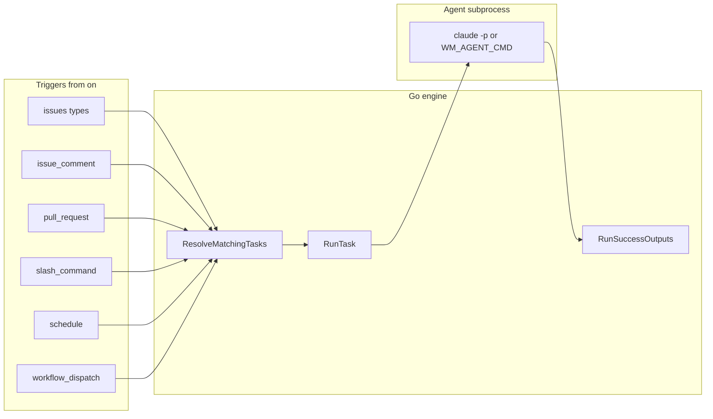
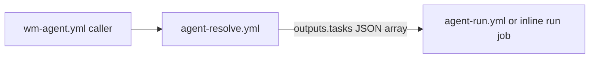

# Architecture

## Goals (design intent)

- **gh-aw format compatibility**: Task files use Markdown + YAML frontmatter like [Agentic Workflows (gh-aw)](https://github.github.io/gh-aw/); you can drop community workflows into `.wm/tasks/`.
- **No compile step**: No `.lock.yml`, no `gh aw compile`.
- **Go + `go-gh`**: GitHub auth follows `gh auth login` (see [`internal/ghclient`](../../internal/ghclient/) for API usage from commands like `assign`).
- **Thin coordination on GitHub**: Issues, labels, Actions, PRs—no extra control plane.

## High-level pipeline

Each task follows **trigger → resolve → run** (`RunTask`). The run is a **five-phase pipeline** in-process (no gh-aw-style compile): **activation** (event/task validation, optional `wm.state_labels` working label, feature branch for PR mode), **agent** (`runAgent` subprocess), **validation** (successful exit and output size bound), **safe-outputs** ([`internal/output`](../../internal/output/) when keys exist under `safe-outputs:` — hints only; not enforced like gh-aw), and **conclusion** (`defer`: done/failed labels, checkpoint comment, branch rollback on failure). [`RunTask`](../../internal/engine/runner.go) returns a [`types.RunResult`](../../internal/types/types.go) with `Phase`, `Success`, `Errors`, and `AgentResult`; `wm run` logs `phase=` on stderr for the last completed or failing phase.

Optional **checkpoints** ([`internal/checkpoint`](../../internal/checkpoint/checkpoint.go)): when `WM_CHECKPOINT=1`, the runner loads the latest checkpoint from issue comments into the prompt before the agent, and posts a new checkpoint comment after a successful run (before/after also tied to outputs and state labels—see [`internal/engine/runner.go`](../../internal/engine/runner.go)).

## Code map

| Concern | Location | Role |
|---------|----------|------|
| CLI entry | [`cmd/`](../../cmd/) | Cobra commands: `init`, `upgrade`, `update`, `assign`, `resolve`, `run`, `status`, `logs`, `add`. |
| Config + tasks | [`internal/config/`](../../internal/config/) | Load `.wm/config.yml`, parse `.wm/tasks/*.md` frontmatter ([`frontmatter.go`](../../internal/config/frontmatter.go)). |
| Event → task names | [`internal/trigger/match.go`](../../internal/trigger/match.go) | `MatchOnOR`: implements `on:` OR-semantics against [`types.GitHubEvent`](../../internal/types/types.go). |
| Orchestration | [`internal/engine/`](../../internal/engine/) | `ResolveMatchingTasks` ([`resolver.go`](../../internal/engine/resolver.go)), `RunTask` ([`runner.go`](../../internal/engine/runner.go)), activation checks ([`activation.go`](../../internal/engine/activation.go)), output validation ([`validation.go`](../../internal/engine/validation.go)), conclusion/defer ([`conclusion.go`](../../internal/engine/conclusion.go)), `runAgent` ([`agent.go`](../../internal/engine/agent.go)), state labels ([`state.go`](../../internal/engine/state.go)). |
| Post-agent steps | [`internal/output/`](../../internal/output/) | `RunSuccessOutputs`: `create-pull-request`, `add-labels`, `add-comment` when keys exist under `safe-outputs:`. |
| `wm-agent.yml` generation | [`internal/gen/wmagent.go`](../../internal/gen/wmagent.go), [`schedules.go`](../../internal/gen/schedules.go) | Union of `on.schedule` strings; writes caller workflow. |
| Embedded templates | [`internal/templates/`](../../internal/templates/) | Starters for `gh wm init` (`config.yml`, tasks, `CLAUDE.md`). |
| GitHub API helpers | [`internal/ghclient/`](../../internal/ghclient/) | Labels, issue comments (`gh api`). |
| Feature branch before PR | [`internal/gitbranch/`](../../internal/gitbranch/) | When `safe-outputs` includes `create-pull-request`, create `wm/<task>-…` on the default branch so the agent does not commit directly to `main`. |

## GitHub Actions: reusable workflows and generated `wm-agent.yml`

Business repos use an **auto-generated** `wm-agent.yml` (from `gh wm init` / `gh wm upgrade`). Runner labels come from **`workflow.runs_on`** in [`.wm/config.yml`](task-format.md); optional **`workflow.pre_steps`** lists prerequisite Actions steps (toolchains, deps); `upgrade` rewrites `wm-agent.yml` when you change them.

- **Resolve** always uses reusable **`agent-resolve.yml`**.
- **Run** uses reusable **`agent-run.yml`** when **`workflow.pre_steps` is empty**. If **`workflow.pre_steps` is set**, the generator embeds the same checkout → pre-steps → `gh-wm` install → `gh-wm run` sequence **inline** in `wm-agent.yml` (reusable workflows cannot take arbitrary step YAML as inputs).

1. **`agent-resolve.yml`** ([`.github/workflows/agent-resolve.yml`](../../.github/workflows/agent-resolve.yml))  
   - `runs-on` is driven by the **`runs_on` workflow input** (JSON array of labels), with default `["ubuntu-latest"]`; generated `wm-agent.yml` passes labels from `.wm/config.yml`.
   - Checks out the repo, installs `gh-wm` (`go install`), writes `event.json`, runs:
   - `gh-wm resolve --repo-root . --event-name "$EVENT_NAME" --payload event.json --json`  
   - Exposes the printed JSON array as job output `tasks`.

2. **`agent-run.yml`** ([`.github/workflows/agent-run.yml`](../../.github/workflows/agent-run.yml)) — **when `workflow.pre_steps` is unset**  
   - Matrix over `fromJSON(needs.resolve.outputs.tasks)` with `fail-fast: false`.  
   - Runs `gh-wm run --repo-root . --task "$TASK_NAME" --event-name "$EVENT_NAME" --payload event.json` with `ANTHROPIC_API_KEY` for the agent.

3. **Inline `run` job** — **when `workflow.pre_steps` is set**  
   - Same matrix and `gh-wm run` invocation; steps include **`workflow.pre_steps`** after checkout and before installing `gh-wm`.

**Note:** In CI, the installed binary name is `gh-wm`. When installed as a `gh` extension, the same commands are available as `gh wm …`.

## Resolve behavior details

- [`engine.ResolveMatchingTasks`](../../internal/engine/resolver.go) loads all tasks and keeps those where `trigger.MatchOnOR(event, task.OnMap())` is true.
- **Schedule events**: For `event_name == schedule`, every task that includes `on.schedule` matches at resolve time. Optional filter: if `WM_SCHEDULE_CRON` is set (e.g. to the workflow’s cron string), tasks are further filtered with `trigger.ScheduleCronMatches` so only the intended task runs for that cron.
- **Payload**: Event JSON is read from `--payload` or `GITHUB_EVENT_PATH` when set; if both are unset, the payload defaults to `{}`. Event name comes from `--event-name` or `GITHUB_EVENT_NAME`.

## Run behavior details

- [`engine.RunTask`](../../internal/engine/runner.go) returns a [`RunResult`](../../internal/types/types.go) with phase, accumulated errors, and timing. It validates the event and engine, builds [`TaskContext`](../../internal/types/types.go), optionally loads checkpoint text, applies **working** label if `wm.state_labels` is set, optionally creates a **feature branch** via [`internal/gitbranch`](../../internal/gitbranch/) when `safe-outputs` includes `create-pull-request` (see CLI reference), runs `runAgent`, validates agent output size and success, then on success runs **`output.RunSuccessOutputs`** (PR / labels / comment). A **deferred conclusion** always runs: on success, checkpoint comment if `WM_CHECKPOINT=1` and **done** labels; on failure, **failed** labels and **checkout** of the previous branch if a feature branch was created.
- [`runAgent`](../../internal/engine/agent.go) builds the prompt from the task body + `context.files` + optional checkpoint hint; sets `WM_TASK_TOOLS` when `tools:` is present; selects CLI via `WM_AGENT_CMD` or `engine:` (`claude`, `codex`, `copilot` requires `WM_AGENT_CMD`). Default **`claude`** uses **stdin** for the prompt, **`--dangerously-skip-permissions`**, and optional **`--model`** / **`--max-turns`** from global config so the agent can run tools (including **`gh`**) non-interactively.
- **Timeout**: [`cmd/run`](../../cmd/run.go) uses `timeout-minutes` from task frontmatter (default 45, max 480).

## Security posture (minimal)

- No sandbox or `safe-outputs` enforcement in-process; workflow permissions and branch protection apply.
- Draft PR defaults in `safe-outputs` / `.wm/config.yml` feed `gh pr create` when `create-pull-request` is listed.
