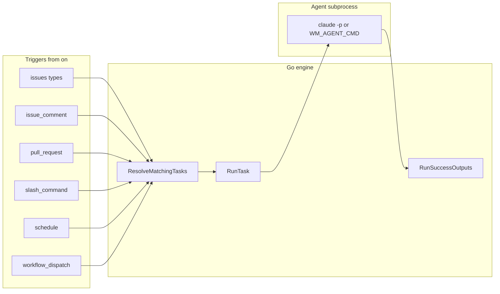
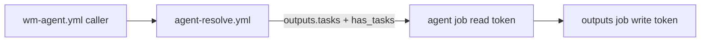

# Architecture

## Goals (design intent)

- **gh-aw format compatibility**: Task files use Markdown + YAML frontmatter like [Agentic Workflows (gh-aw)](https://github.github.io/gh-aw/); you can drop community workflows into `.wm/tasks/`.
- **No compile step**: No `.lock.yml`, no `gh aw compile`.
- **Go + `go-gh`**: GitHub auth follows `gh auth login` (see [`internal/ghclient`](../../internal/ghclient/) for API usage from commands like `assign`).
- **Thin coordination on GitHub**: Issues, labels, Actions, PRs—no extra control plane.

## High-level pipeline

Each task follows **trigger → resolve → run** (`RunTask`). The run is a **five-phase pipeline** in-process (no gh-aw-style compile): **activation** (event/task validation, feature branch for PR mode, **per-run artifact dir** under `.wm/runs/` or `WM_RUN_DIR`), **agent** (`runAgent` subprocess — **`WM_SAFE_OUTPUT_FILE`** set to per-run **`output.jsonl`** when a run dir exists), **validation** (successful exit and output size bound; context deadline surfaced as timeout), **safe-outputs** ([`internal/output`](../../internal/output/) — reads **`output.jsonl`** (`gh wm emit`) when `safe-outputs:` is non-empty; **`max:`** / label allowlists enforced; empty output warns and succeeds), and **conclusion** (`defer`: checkpoint comment, branch rollback on failure, **`result.json`**). [`RunTask`](../../internal/engine/runner.go) returns a [`types.RunResult`](../../internal/types/types.go) with `Phase`, `Success`, `Errors`, `RunDir`, and `AgentResult`; `wm run` logs `phase=` and `artifacts=` on stderr when a run directory is created.

Optional **checkpoints** ([`internal/checkpoint`](../../internal/checkpoint/checkpoint.go)): when `WM_CHECKPOINT=1`, the runner loads the latest checkpoint from issue comments into the prompt before the agent, and posts a new checkpoint comment after a successful run (see [`internal/engine/runner.go`](../../internal/engine/runner.go)).

## Code map

| Concern | Location | Role |
|---------|----------|------|
| CLI entry | [`cmd/`](../../cmd/) | Cobra commands: `init`, `upgrade`, `update`, `assign`, `resolve`, `run`, `process-outputs`, `emit`, `status`, `logs`, `add`. |
| Config + tasks | [`internal/config/`](../../internal/config/) | Load `.wm/config.yml`, parse `.wm/tasks/*.md` frontmatter ([`frontmatter.go`](../../internal/config/frontmatter.go)). |
| Event → task names | [`internal/trigger/match.go`](../../internal/trigger/match.go) | `MatchOnOR`: implements `on:` OR-semantics against [`types.GitHubEvent`](../../internal/types/types.go). |
| Orchestration | [`internal/engine/`](../../internal/engine/) | `ResolveMatchingTasks` and `ResolveForcedTask` ([`resolver.go`](../../internal/engine/resolver.go)) — forced resolve pins one task by filename without evaluating `on:` (matches local `gh wm run`); `RunTask` ([`runner.go`](../../internal/engine/runner.go)), per-run dirs ([`rundir.go`](../../internal/engine/rundir.go)), activation checks ([`activation.go`](../../internal/engine/activation.go)), output validation ([`validation.go`](../../internal/engine/validation.go)), conclusion/defer ([`conclusion.go`](../../internal/engine/conclusion.go)), `runAgent` ([`agent.go`](../../internal/engine/agent.go)). |
| Post-agent steps | [`internal/output/`](../../internal/output/) | `RunSuccessOutputs`: applies **`output.jsonl`** (`gh wm emit`) when `safe-outputs:` is set (see [task-format](task-format.md)). |
| `wm-agent.yml` generation | [`internal/gen/wmagent.go`](../../internal/gen/wmagent.go), [`triggers.go`](../../internal/gen/triggers.go), [`schedules.go`](../../internal/gen/schedules.go) | Task-driven union of GitHub **`on:`** keys (issues / issue_comment / pull_request types, `slash_command` → issue_comment, `on.schedule` crons); writes caller workflow. |
| Embedded templates | [`internal/templates/`](../../internal/templates/) | Starters for `gh wm init` (`config.yml`, tasks). |
| GitHub API helpers | [`internal/ghclient/`](../../internal/ghclient/) | Labels, issue comments (`gh api`). |
| Feature branch before PR | [`internal/gitbranch/`](../../internal/gitbranch/) | When `safe-outputs` includes `create-pull-request`, create `wm/<task>-…` on the default branch so the agent does not commit directly to `main`. |

## GitHub Actions: reusable workflows and generated `wm-agent.yml`

Business repos use an **auto-generated** `wm-agent.yml` (from `gh wm init` / `gh wm upgrade`). Runner labels come from **`workflow.runs_on`** in [`.wm/config.yml`](task-format.md); optional **`workflow.install_claude_code`** (default **true**) controls whether CI installs the **Claude Code** CLI before **`gh-wm run`**; optional **`workflow.gh_wm_extension_version`** passes **`--pin`** to **`gh extension install`** (tag or commit; see **`gh help extension install`**); optional **`workflow.pre_steps`** lists prerequisite Actions steps (toolchains, deps); `upgrade` rewrites `wm-agent.yml` when you change them.

- **Resolve** always uses reusable **`agent-resolve.yml`**.
- **Run** uses reusable **`agent-run.yml`** when **`workflow.pre_steps` is empty**. If **`workflow.pre_steps` is set**, the generator embeds the same checkout → pre-steps → **`gh extension install`** → (optional) Claude Code install → **`gh wm run --agent-only`** → pack workspace → artifact → **`gh wm process-outputs`** sequence **inline** in `wm-agent.yml` (reusable workflows cannot take arbitrary step YAML as inputs).

1. **`agent-resolve.yml`** ([`.github/workflows/agent-resolve.yml`](../../.github/workflows/agent-resolve.yml))  
   - `runs-on` is driven by the **`runs_on` workflow input** (JSON array of labels), with default `["ubuntu-latest"]`; generated `wm-agent.yml` passes labels from `.wm/config.yml`.
   - Checks out the repo, ensures **`gh`** via the composite **`install-gh-cli`** action (official **`cli/cli`** Linux tarball when **`gh`** is missing on self-hosted runners), installs **`gh-wm`** via **`gh extension install`**, writes the GitHub event JSON to **`.wm/runs/github-event.json`** (under the ignored `runs/` tree; see **`.wm/.gitignore`**) so `git status` stays clean for **`gh wm run`**’s working-tree check, then runs:
   - `gh wm resolve --repo-root . --event-name "$EVENT_NAME" --payload .wm/runs/github-event.json --json`  
   - Exposes the printed JSON array as job output `tasks`, and sets **`has_tasks`** to the string **`true`** or **`false`** so the caller can skip the **`run`** job when nothing matched (avoids matrix/`fromJSON` errors on empty input).

2. **`agent-run.yml`** ([`.github/workflows/agent-run.yml`](../../.github/workflows/agent-run.yml)) — **when `workflow.pre_steps` is unset**  
   - The generated caller runs this workflow only when **`needs.resolve.outputs.has_tasks == 'true'`**. Matrix over `fromJSON(needs.resolve.outputs.tasks)` with `fail-fast: false`.  
   - **Two jobs** (token sandbox): **`agent`** uses **`permissions: contents|issues|pull-requests: read`** so the **`GITHUB_TOKEN`** available to the agent subprocess cannot mutate GitHub state; it runs **`gh wm run … --agent-only`**, then **`tar`** the entire workspace (including **`.git`** and **`.wm/runs/<id>/`**) into **`${{ runner.temp }}/wm-workspace.tar.gz`** (per job, so parallel matrix legs on self-hosted runners do not race on a shared **`/tmp`** path) and uploads **`wm-workspace-<task>-<run_id>.tar.gz`** as an artifact. **`outputs`** (needs **`agent`**) uses **`permissions: write`**, downloads that artifact to **`${{ runner.temp }}`** (not the repo root), **`tar -xzf`** into **`GITHUB_WORKSPACE`**, and runs **`gh wm process-outputs --run-dir …`** to apply **`safe-outputs:`** and conclusion with a write-capable token (download outside the checkout avoids leaving the archive as an untracked file, which would break **`gh pr create`**).  
   - Upload/download use **`actions/upload-artifact@v5`** and **`actions/download-artifact@v7`** (Node.js 24). Self-hosted runners must be **Actions Runner 2.327.1** or newer for **`download-artifact@v7`**.  
   - Unless **`install_claude_code`** is **false**, the **`agent`** job runs the official Claude Code installer (`https://claude.ai/install.sh`) and appends **`$HOME/.local/bin`** to **`GITHUB_PATH`** so **`claude`** is on **`PATH`** on minimal self-hosted runners.

3. **Inline `run_agent` / `run_outputs` jobs** — **when `workflow.pre_steps` is set**  
   - Same matrix and the same read/write split as **`agent-run.yml`** (payload under **`.wm/runs/github-event.json`**); steps include **`workflow.pre_steps`** after checkout and before **`gh extension install`**; when **`workflow.install_claude_code`** is **true** (default), the same Claude Code install + **`GITHUB_PATH`** steps run before **`gh wm run --agent-only`**. **`run_outputs`** is gated with **`if: always() && !cancelled() && …`** so a failing matrix leg for one task does not skip **`process-outputs`** for other tasks. The **`process-outputs`** step uses **`gh wm process-outputs --task "<task>"`** so the **`gh-wm`** binary resolves the newest **`.wm/runs/<id>/`** for that task (same logic as **`--run-dir`**, no extra runtime dependencies).

### GitHub Actions token sandbox

[`agent-run.yml`](../../.github/workflows/agent-run.yml) enforces **safe-outputs** by denying the agent **direct** `gh` writes: the **`agent`** job runs with a **read-only** `GITHUB_TOKEN` (repository read on contents/issues/PRs). Intended GitHub mutations go through **`gh wm emit`** into **`output.jsonl`**, then the **`outputs`** job runs **`gh wm process-outputs --run-dir <path>`** ([`engine.ProcessRunOutputs`](../../internal/engine/process_outputs.go)) so only **policy-validated** actions execute. **`process-outputs`** requires a persisted **`result.json`** from **`gh wm run --agent-only`** with **`agent_result.success`** true; otherwise it refuses to apply outputs. The workspace tarball preserves **`.git`** so **`create-pull-request`** (`git push` + **`gh pr create`**) still works in the **`outputs`** job. For **`create_pull_request`**, **`add_labels`**, and **`create_issue`** outputs that use labels, **`gh-wm`** ensures each label exists on the repository (create with a default color if missing) before **`gh pr create`** or issue APIs run, so repos do not need labels pre‑seeded. **Activation** side effects that require write (**`on.reaction`**) may **fail** in the **`agent`** job on a read-only token; they are logged and the run continues (see [`runner.go`](../../internal/engine/runner.go)).

**Note:** In CI, the installed binary name is `gh-wm`. When installed as a `gh` extension, the same commands are available as `gh wm …`.

### Loop prevention (generated `wm-agent.yml`)

The generator adds **workflow-level** defenses so agent side effects (labels, comments, PRs) are less likely to cascade into repeated runs—especially when **`gh`** uses a **PAT** (where GitHub does not suppress follow-up workflow runs the way it does for the default **`GITHUB_TOKEN`**):

- **`concurrency`**: one in-flight run per issue/PR number (falls back to `github.run_id` for schedule/dispatch).
- **`resolve` job `if:`**: skips when **`github.actor`** is **`github-actions[bot]`**, except for **`schedule`** and **`workflow_dispatch`** (those are always evaluated).

[`ResolveMatchingTasks`](../../internal/engine/resolver.go) adds resolver-side guards before **`MatchOnOR`**: skip events whose **`sender`** is a **Bot** (same exceptions: **`schedule`**, **`workflow_dispatch`**); **`issue_comment`** ignores comments that contain the hidden **`<!-- wm-agent:`** marker appended by **`add-comment`** and checkpoint posts. Use **`on.issues.labels`** in tasks that should run only when specific labels are added (see [task-format](task-format.md)).

## Resolve behavior details

- [`engine.ResolveMatchingTasks`](../../internal/engine/resolver.go) applies the loop guards above, then loads all tasks and keeps those where `trigger.MatchOnOR(event, task.OnMap())` is true.
- **Schedule events**: For `event_name == schedule`, every task that includes `on.schedule` matches at resolve time. Optional filter: if `WM_SCHEDULE_CRON` is set (e.g. to the workflow’s cron string), tasks are further filtered with `trigger.ScheduleCronMatches` (recomputes the same fuzzy cron as `gen.FuzzyNormalizeSchedule` for that task path) so only the intended task runs for that cron.
- **Payload**: Event JSON is read from `--payload` or `GITHUB_EVENT_PATH` when set; if both are unset, the payload defaults to `{}`. Event name comes from `--event-name` or `GITHUB_EVENT_NAME`.

## Run behavior details

- [`engine.RunTask`](../../internal/engine/runner.go) returns a [`RunResult`](../../internal/types/types.go) with phase, accumulated errors, timing, and **`RunDir`**. It validates the event and engine, builds [`TaskContext`](../../internal/types/types.go), creates a **per-run directory** ([`NewRunDir`](../../internal/engine/rundir.go): `.wm/runs/<id>/` or `WM_RUN_DIR/<id>/`), optionally loads checkpoint text, optionally creates a **feature branch** via [`internal/gitbranch`](../../internal/gitbranch/) when `safe-outputs` includes `create-pull-request` (see CLI reference), runs `runAgent` (writes **`prompt.md`**, appends **safe outputs** instructions when `safe-outputs:` is set, sets **`WM_SAFE_OUTPUT_FILE`**, streams combined stdout/stderr to a per-run **agent log file** — default **`agent-stdout.log`**, or structured **`conversation.json`** / **`conversation.jsonl`** when print-mode JSON is enabled for the built-in **`claude`** CLI; **SIGTERM** then kill on Unix when the run context is canceled), validates agent output size (from log file stat when present) and success, then on success runs **`output.RunSuccessOutputs`** unless **`RunOptions.AgentOnly`** is set (CI token sandbox: stop after validation; use [`ProcessRunOutputs`](../../internal/engine/process_outputs.go) later). Empty **`output.jsonl`** **warns** and succeeds (implicit noop). A **deferred conclusion** runs when **not** agent-only: on success, checkpoint comment if `WM_CHECKPOINT=1`; on failure, **checkout** of the previous branch if a feature branch was created; finally **`result.json`** and **`meta.json`** (phase **conclusion**). With **`AgentOnly`**, the defer writes **`result.json`** / **`run.json`** without conclusion; **`ProcessRunOutputs`** performs outputs + conclusion.
- [`runAgent`](../../internal/engine/agent.go) builds the prompt from the task body + `context.files` + optional checkpoint hint + **Available Outputs** (when `safe-outputs:` is non-empty); sets `WM_TASK_TOOLS` when `tools:` is present; selects CLI via `WM_AGENT_CMD` or `engine:` (`claude`, `codex`; use `WM_AGENT_CMD` for a custom CLI). Default **`claude`** uses **stdin** for the prompt, **`--dangerously-skip-permissions`**, and optional **`--model`** / **`--max-turns`** from global config so the agent can run tools (including **`gh`**) non-interactively. When **`claude_output_format`** / **`WM_CLAUDE_OUTPUT_FORMAT`** request **`json`** or **`stream-json`**, the runner also passes **`--output-format`** and, for **`stream-json`**, **`--verbose`** (built-in **`claude`** only; **`WM_AGENT_CMD`** and **codex** keep plain-text capture). When **`RunOptions.LogWriter`** is set (e.g. **`gh wm run`** streaming to stderr), built-in **`claude`** forces **`stream-json`** so subprocess output is newline-delimited as events occur instead of buffering **`text`** until exit; the raw JSONL is written unchanged to **`conversation.jsonl`**, while the log writer receives human-readable lines parsed from the same stream ([`logstream.go`](../../internal/engine/logstream.go)). In-memory **`Stdout`/`Summary`** hold a **64 KiB tail** of the transcript when a run dir is used (full text is on disk).
- **Timeout**: [`cmd/run`](../../cmd/run.go) uses `timeout-minutes` from task frontmatter (default 45, max 480).

## RunTask pipeline (detailed reference)

Implementation: [`RunTask`](../../internal/engine/runner.go), [`rundir.go`](../../internal/engine/rundir.go), [`activation.go`](../../internal/engine/activation.go), [`validation.go`](../../internal/engine/validation.go), [`conclusion.go`](../../internal/engine/conclusion.go).

**Contract:** One `gh-wm run` / `gh wm run` process executes the pipeline below. The primary API result is [`types.RunResult`](../../internal/types/types.go) (`Phase`, `Success`, `AgentResult`, `Errors`, `Duration`, `RunDir`) plus a Go `error`. **Conclusion** (checkpoint, branch rollback, **`result.json`**) runs in a **`defer`** after `task` and `tc` are set; if the run fails earlier (e.g. config load, missing task, invalid event), `tc` may be nil and **conclusion does nothing** (and no run dir is created if failure is before `NewRunDir`).

### Phase 1 — Activation (`PhaseActivation`)

| Reads | Purpose |
|-------|---------|
| Disk: `.wm/config.yml`, `.wm/tasks/*.md` | `config.Load` → global config + tasks |
| In-memory: `*GitHubEvent` | Must be non-nil; `Payload` non-nil; `Name` non-empty (except `unknown` for local empty-event runs) |
| Env: `GITHUB_REPOSITORY`, `WM_AGENT_CMD`, task `engine:` / global `engine` | Engine validation |
| Env: `WM_CHECKPOINT=1` (optional) | Enables checkpoint **read** below |
| Env: `WM_RUN_DIR` (optional) | Base path for per-run dirs instead of `<repo>/.wm/runs/` |
| Disk: `claude_output_format` in `.wm/config.yml`; env: `WM_CLAUDE_OUTPUT_FORMAT` (optional) | Overrides config when set: **`text`** (default), **`json`**, or **`stream-json`** for built-in **`claude`** — chooses run-dir filename, **`--output-format`**, and **`--verbose`** when **`stream-json`** |
| GitHub API: `ghclient.ListIssueCommentBodies` (optional) | Only with checkpoint mode + `GITHUB_REPOSITORY` + issue/PR number: load comment bodies to find latest `<!-- wm-checkpoint: … -->` |

| In-memory outputs | |
|-------------------|--|
| `TaskContext` | Task name, `RepoPath`, event, issue/PR numbers from payload (`extractNumbers`) |
| `CheckpointHint` | Latest checkpoint summary text for the agent prompt |

| Writes / side effects | Where |
|----------------------|--------|
| Optional: feature branch | Local git repo (`gitbranch.PrepareFeatureForPR`) when `safe-outputs` includes `create-pull-request` |
| **Per-run directory** | **`<repo>/.wm/runs/<id>/`** or **`WM_RUN_DIR/<id>/`**: `meta.json` (phase **activation**); **`PruneRunDirs`** drops dirs older than 7 days under `.wm/runs` (and under `WM_RUN_DIR` when set) |

### Phase 2 — Agent (`PhaseAgent`)

| Reads | Purpose |
|-------|---------|
| Task body, global `context.files` | Prompt in [`runAgent`](../../internal/engine/agent.go) |
| `CheckpointHint` | Appended to prompt |
| Repo working tree | Agent subprocess `Dir` = `--repo-root`; agent may edit files / run git |

| Outputs | |
|---------|--|
| `AgentResult` | Combined transcript: full agent log on disk (**`agent-stdout.log`**, or **`conversation.json`** / **`conversation.jsonl`** when structured print-mode output is enabled for built-in **`claude`**); **`Stdout`/`Summary`** hold a **64 KiB tail** when a run dir exists (for checkpoints/comments); `Success`, `ExitCode`, **`TimedOut`** if context deadline exceeded |
| Optional stream | Tee to `RunOptions.LogWriter` (CLI uses stderr) and to the same per-run log file; raw bytes match the subprocess (e.g. **`conversation.jsonl`** when **`stream-json`**) while stderr shows formatted **`[tool]`** / **`[agent]`** / **`[result]`** lines when streaming is enabled |

### Phase 3 — Validation (`PhaseValidation`)

| Reads | Purpose |
|-------|---------|
| `AgentResult`, run `context` | In-process checks; deadline → **timeout** error |

| Checks | |
|--------|--|
| [`validateAgentOutputErr`](../../internal/engine/validation.go) | Non-nil result, `Success`, not timed out; size from the on-disk agent log path when set, else in-memory text length ≤ 12 MiB. **Empty** successful output is allowed. |

### Phase 4 — Safe outputs (`PhaseOutputs`)

| Reads | Purpose |
|-------|---------|
| `AgentResult.SafeOutputFilePath`, `output.jsonl`, `TaskContext`, `safe-outputs:` | [`RunSuccessOutputs`](../../internal/output/output.go): NDJSON **`items`** (**empty** warns with implicit noop) |

| Writes (if configured / requested) | Persistence |
|---------------------------|-------------|
| `create-pull-request` / `create_pull_request` | `git push`, `gh pr create` → GitHub |
| `create-issue` / `create_issue` | `gh issue create` → GitHub |
| `add-labels` / `add_labels` | GitHub API → labels |
| `remove-labels` / `remove_labels` | GitHub API → remove labels |
| `add-comment` / `add_comment` | `gh issue comment` / `gh pr comment` → GitHub |
| `noop` | Log only |
| `missing_tool` / `missing_data` | Log only |

### Phase 5 — Conclusion (deferred)

Runs in `defer` via [`concludeRun`](../../internal/engine/conclusion.go) only when **`task` and `tc` are non-nil**.

**On success (`runSucceeded`):**

| Action | Reads | Writes |
|--------|-------|--------|
| Checkpoint | `WM_CHECKPOINT=1`, `AgentResult` text | New issue comment (`ghclient.PostIssueComment`), body includes encoded checkpoint plus hidden **`<!-- wm-agent:`** footer for loop prevention |

**On failure:**

| Action | Reads | Writes |
|--------|-------|--------|
| Branch rollback | `branchCreated`, `prevBranch` | `git checkout` previous branch on disk (if applicable) |
| **Artifacts** | `RunResult` | **`meta.json`** (phase **conclusion**), **`result.json`** (serialized outcome) |

Checkpoint failures are appended to `RunResult.Errors` and do not always change the primary returned `error` from an earlier phase.

### What persists where

| Kind | Where |
|------|--------|
| `RunResult` / errors | In-memory for the process; CLI prints `phase=`, **`artifacts=`**, and `failure phase:` on **stderr** |
| Per-run artifacts | **`.wm/runs/<id>/`** (or **`WM_RUN_DIR/<id>/`**): `prompt.md`; optional **`output.jsonl`** (`gh wm emit`); combined agent stdout/stderr (**`agent-stdout.log`** by default, or **`conversation.json`** / **`conversation.jsonl`** when **`claude_output_format`** / **`WM_CLAUDE_OUTPUT_FORMAT`** is **`json`** / **`stream-json`** for built-in **`claude`**); `meta.json` (phase updates); `result.json` (final snapshot); **`run.json`** (merged meta + outcome for tooling). Ignore **`runs/`** under **`.wm/`** via **`.wm/.gitignore`** (`gh wm init` / `gh wm upgrade` ensure that file). |
| Agent tail in memory | Last **64 KiB** of combined output in `AgentResult` when a run dir is used (full output remains in the per-run agent log file above) |
| Repo state | Whatever git / the agent wrote under `--repo-root` |
| Coordination | GitHub: labels, issue/PR comments, PRs — the main external persistence |
| Checkpoints | Issue comments when `WM_CHECKPOINT=1`, encoded in [`internal/checkpoint`](../../internal/checkpoint/checkpoint.go) |

**Note:** `RunResult.Phase` is the last phase reached or where failure occurred; it is **not** set to a separate `conclusion` value after the defer. There is no collaborator/actor permission gate in the current implementation.

## Security posture (minimal)

- In **GitHub Actions** with the generated **`agent-run.yml`**, the **`agent`** job uses a **read-only** token so direct **`gh`** mutations from the subprocess fail; validated writes happen only in the **`outputs`** job via **`gh wm process-outputs`** ([`internal/output`](../../internal/output/)). **Local** `gh wm run` still uses your normal **`gh`** auth unless you enforce otherwise.
- Agent-driven **`output.jsonl`** is filtered by declared **`safe-outputs:`** keys, **`max:`**, and label allowlists.
- Draft PR defaults in `safe-outputs` / `.wm/config.yml` feed `gh pr create` when `create-pull-request` is listed (agent can override **`draft`** per item when requesting **`create_pull_request`**).
